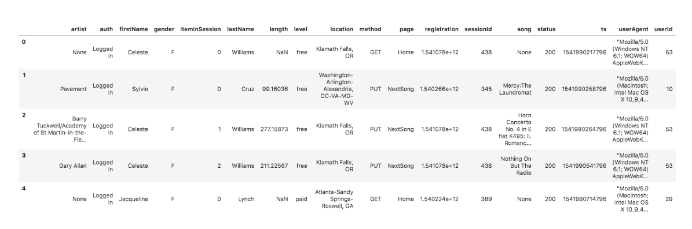
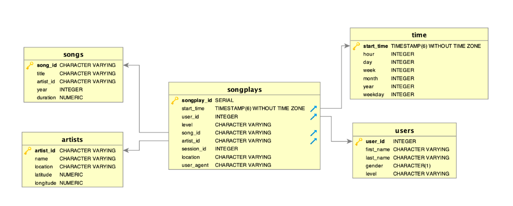

# Introduction

A music streaming startup, Sparkify, has grown their user base and song database even more and want to move their data warehouse to a data lake. Their data resides in S3, in a directory of JSON logs on user activity on the app, as well as a directory with JSON metadata on the songs in their app.

Here our task is to create a Postgres database with tables designed to optimize queries on song play analysis. We need to create a database schema and ETL pipeline for this analysis. This allows analytics team to continue finding insights in what songs their users are listening to.

Here we can test our database and ETL pipeline by running queries given by the analytics team from Sparkify and the obtained results are compared with that of actual results.

# **Project Description:**

Here we need to define both fact and dimension tables for a star schema with respect to particular analytic focus.
We need to write an ETL pipeline that transfers data from files in two local directories into these tables in Postgres using Python and SQL.

# **Dataset Description:**

Here we will be working with two datasets that are already there in S3 bucket.The S3 links for the buckets are as follows:

**Song data:** s3://udacity-dend/song_data

**Log data:** s3://udacity-dend/log_data

**Log data json path:** s3://udacity-dend/log_json_path.json

# **Song Dataset:**

Here the song dataset is a subset of real data from Million Song Dataset.Each file is in JSON format and contains metadata about a song and the artist of that song. The files are partitioned by the first three letters of each song's track ID. 

{"num_songs": 1, 
"artist_id": "ARJIE2Y1187B994AB7", 
"artist_latitude": null,
"artist_longitude": null,
"artist_location": "",
"artist_name": "Line Renaud", 
"song_id": "SOUPIRU12A6D4FA1E1", 
"title": "Der Kleine Dompfaff", 
"duration": 152.92036,
"year": 0}

# **Log Dataset:**

The second dataset consists of log files in JSON format generated by this event simulator based on the songs in the dataset above. These simulate app activity logs from an imaginary music streaming app based on configuration settings. The sample dataframe of the Log Dataset is as follows:

# **Schema for Song Play Analysis:**

Using the song and log datasets, we will be creating a star schema optimized for queries on song play analysis. This includes the following tables.

The fact tables are as follows:

1. **songplays:** This talble holds records in log data associated with song plays i.e. records with page NextSong
   *Columns:* songplay_id, start_time, user_id, level, song_id, artist_id, session_id, location, user_agent.

The Dimension tables are as follows:

1. **Users:** This table gives all the details about the users in the app.
   *Columns:* user_id, first_name, last_name, gender, level.

2. **songs:** This tables gives all the details about the songs in the music database.
   *Columns:* song_id, title, artist_id, year, duration.

3. **artists:** This table gives us all the details about the artists of the songs in the database.
   *Columns:* artist_id, name, location, lattitude, longitude.

4. **time:** This table gives timestamps of records in songplays which are broken down into specific units.
   *Columns:* start_time, hour, day, week, month, year, weekday.

# **Project Template:**

In addition to the data files, the project workspace includes six files:

1. **test.ipynb** This file displays the first few rows of each table with which we can verify about the columns of all the tables.

2. **create_tables.py** This file can be used to create and drop our tables. Whenever we run our ETL scripts, we run this file to reset our tables.

3. **etl.ipynb** With the help of this file, we can read and process a single file from song_data file and log_data file to our tables created using create_tables script. This notebook also holds detailed instructions on the ETL process for each of table.

4. **etl.py** This file reads and process files from song_data and log_data files into our newly created tables.

5. **sql_queries.py** This file contains all coded sql queries and is used by all the three files listed above.

6. **README.md** This gives us detailed description of all the project files, dataset description and the schema of tables.

# Important Instructions:

* Make sure correct column name and types  are included in create_tables.py

* After opening the terminal, run the correct command for writing etl.py file. 